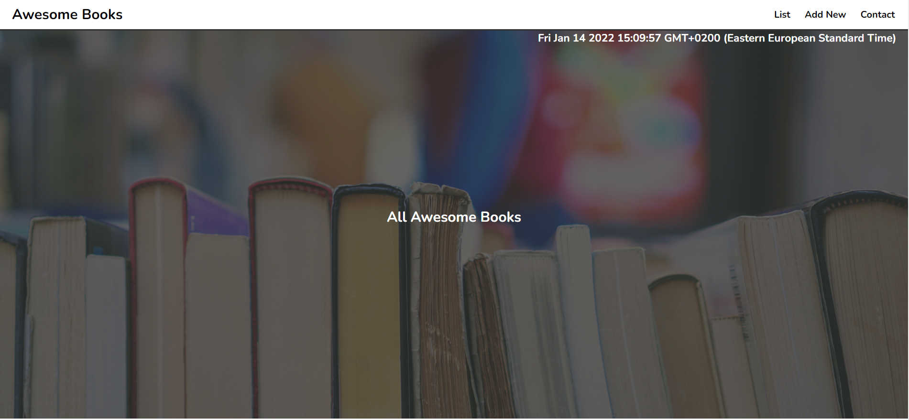

### Awesome books website.

### Setup

To get a local copy up and running follow these simple example steps.

- Clone the repository to your computer using git clone [Git Clone Url](https://github.com/abdulrahmanshr75/Awesome-books.git)
- Cd into the folder
- Open index.html with live server
- Or you can Fork it instead, and create a pull request to suggest some changes

## Prerequisites

- Setup
- Install
- Run tests
- Deployment

## Live Demo

[Live Demo](https://abdulrahmanshr75.github.io/Awesome-books/)

## Built With

- HTML
- CSS
- JavaScript

## technology used

- Linters
- VScode
- html & css
- Javascript
- github

## Authors

👤 Abdulrahman Shrshar
👤 Adekunle Akinkunmi Ismail

- GitHub: [Abdulrahman](https://github.com/abdulrahmanshr75)
- GitHub: [ismail](https://github.com/ismailakinkunmi)
- LinkedIn: [Abdulrahman](https://www.linkedin.com/in/abdulrahman-shrshar-721144161/)
- LinkedIn: [ismail](https://www.linkedin.com/in/ismail-akinkunmi-adekunle-b810aa155/)

## Show your support

- give a thumb 👍 if you like this project

## Contributing

- Contributions, issues, and feature requests are welcome!

## License

- This project is MIT licensed
